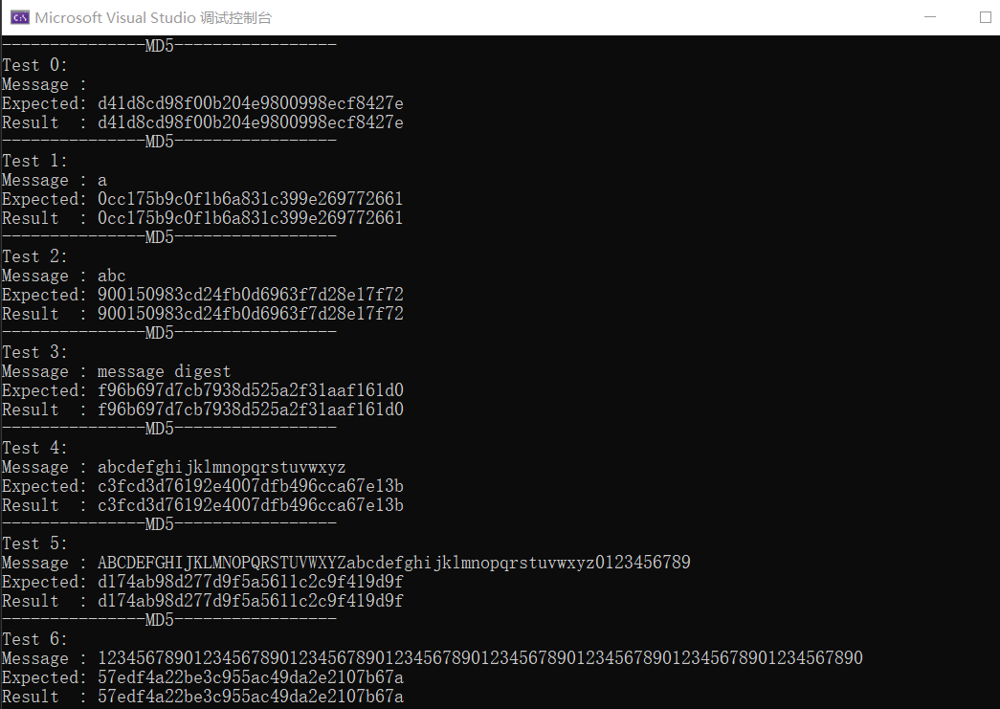
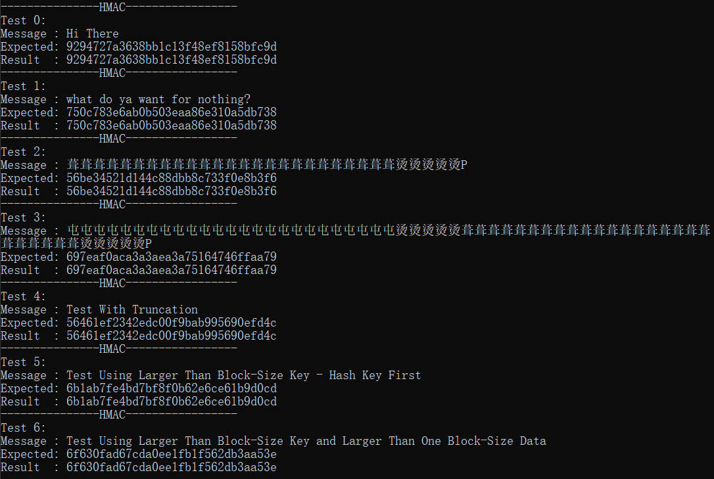

# HMAC-MD5 算法程序设计报告
## MD5 算法原理概述
密码散列函数，将任意长度的消息映射到固定长度的数字指纹（报文摘要）。
- 输入：任意不定长度信息
- 输出：以512-bit进行分组，生成四个32-bit数据，最后联合输出固定128-bit的信息摘要
- 总控流程:
  - 以512-bit消息分组为单位，每一分组 $Y_q (q = 0, 1, …, L-1)$经过4个循环的压缩算法，表示为：
    ```
    CV0 = IV
    CVi = HMD5(CVi-1 , Yi-1), i = 1, …, L.
    ```
  - 输出结果 hash 值：$MD = CV_L$.
- 基本过程：
    - 分块
    每512位数据分为1块进行压缩。压缩过程中累计原始消息数据的位数，保存在64位无符号整型变量`count`中。
    - 填充
    1. 对最后一块填充二进制序列`100…0`，留下末尾6位。              
    2. 填充位数必须在 [1, 512] 范围。如果不足以放下一位填充位，填充两块。                  
    3. 最后将 `count`的低64位按little-endian转移成8个字节顺序填充入末尾64位。    
    4. 对填充后形成的块继续压缩。       
    - 缓冲区初始化
    每个带4个字节 (32-bit) 的4个寄存器构成向量 (A, B, C, D)，也称MD缓冲区。   
    初始化如下：
        ```
        A = 0x67452301
        B = 0xEFCDAB89
        C = 0x98BADCFE
        D = 0x10325476
        ```
    - 循环压缩
    对每个块执行4个循环的压缩算法,每轮循环分别固定不同的生成函数`F, G, H, I`,结合指定的T表元素`T[]`和消息分组的不同部分`X[]`做16次迭代运算,生成下一轮循环的输入。
    每次迭代处理消息分组的32位字,每轮循环中的一次迭代运算逻辑如下：
      - 对 A 迭代：$a \leftarrow b + ((a + g(b, c, d) + X[k] + T[i]) <<< s)$
      - 缓冲区 (A, B, C, D) 作循环置换：$(B, C, D, A) \leftarrow (A, B, C, D) $
    - 得出结果
    对每个寄存器的值按little-endian转换为4个字节，顺序输出其8个16进制数符号。寄存器 A, B, C, D 联合输出的结果是32个16进制数符号


## HMAC 算法原理概述
利用密码散列函数（MD5）和一个密钥，为消息生成固定长度的消息认证码。      
**算法结构**：     
M – message input to HMAC        
H – embedded hash function      
b – length (bits) of input block(MD5:b=64)      
k – secrete key, |k| $\leq$ b     
n – length of hash code      
ipad – 00110110 重复`b/8`次 b位     
opad – 01011010 重复`b/8`次 b位     
$K^+$ – 对共享密钥k右边补0 生成一个b位的数据块      
如果kLen>b，重设为key=MD5(key)    
$$ HMAC_k = H(( K^+ \bigoplus opad ) ‖ H(( K^+ \bigoplus ipad ) ‖ M ))$$    
  
- $S_i=K^+ \bigoplus ipad$
    $K^+$与 $ipad$ 作 $XOR$ 
- $H(S_i ‖ M)$
    对$(S_i ‖ M)$进行HASH压缩（MD5）
- $S_0=K^+ \bigoplus opad$
    $K^+$与 $opad$ 作 $XOR$ 
- $HMAC_k = H(S_0 ‖ H(S_i ‖ M ))$
    对 $S_o ‖ H(S_i ‖ M)$ 进行HASH压缩（MD5）

## 总体结构设计
分为五个文件
- `md5.h` 定义了MD5上下文类和MD5操作函数
- `md5.c` 实现了MD5操作函数
- `hmac_md5.h` 定义了hmac_md5函数
- `hmac_md5.c` 实现了hmac_md5函数
- `main.c` 测试MD5,hmac_md5的有效性文件，来源于`RCF1321`,`RCF2104`

### MD5
参考 `RFC 1321`协议中的实现
如算法原理概述所述，整个算法分为四个部分
- 分块
- 填充
- 循环压缩
- 缓冲区初始化

```c
void md5_digest(unsigned char* input, unsigned int len, unsigned char output[16]) {
	md5_ctx_t ctx;

	md5_init(&ctx);//缓冲区初始化
	md5_update(&ctx, input, len);//分块
	md5_final(&ctx, output);//填充
}
```
其中，循环压缩内嵌在分块与填充中。

### HMAC
参考`RFC 2104`协议中的实现
```c
/*k-密钥
kLen-密钥长度
message-原文
mLen-原文长度
out- 消息摘要
*/
void hmac_md5(unsigned char* k, unsigned int kLen, unsigned char* message, unsigned int mLen, unsigned char* out);
```
## 模块分解
### MD5

在`md5.h`中定义了md5算法的三个接口函数
```c
//初始化上下文结构体开始一个MD5操作
void md5_init(md5_ctx_t* ctx);
//计算除最后填充分组外的分组的摘要
void md5_update(md5_ctx_t* ctx, unsigned char* input , unsigned int inputLen);
//计算最后填充分组的摘要，得到结果HASH值
void md5_final(md5_ctx_t* ctx, unsigned char digest[16]);
```
#### 缓冲区初始化
寄存器值初始化为`IV`，原始消息数据字节数`count`初始化为0
```c
void md5_init(md5_ctx_t* ctx) {
	//初始化寄存器
	ctx->CV[0] = 0x67452301;
	ctx->CV[1] = 0xEFCDAB89;
	ctx->CV[2] = 0x98BADCFE;
	ctx->CV[3] = 0x10325476;
	ctx->count = 0;
}
```
#### 分块
- 每512位数据分为1块进行压缩。压缩过程中累计原始消息数据的位数，保存在64位无符号整型变量`count`中。
- 维护一个缓冲区保存不足一个块的数据。
```c
void md5_update(md5_ctx_t* ctx, unsigned char* input, unsigned int inputLen) {
	unsigned int index = ctx->count % 64;//缓冲区已有的字节数
	unsigned int partLen = 64 - index;//缓冲区还能容纳的字节数
	unsigned int i;
	if (inputLen >= partLen) {
		//填满缓冲区剩余部分并计算摘要
		memcpy(ctx->buffer + index, input, partLen);
		md5_transform(ctx->CV, ctx->buffer);
		//循环处理输入中间的整块部分
		for (i = partLen; i + 63 < inputLen; i += 64) {
			md5_transform(ctx->CV, input+i);
		}
		//将输入剩余部分填入缓冲区
		memcpy(ctx->buffer, input+i, inputLen-i);
	}
	else memcpy(ctx->buffer + index, input, inputLen);
	ctx->count += inputLen;
}
```

#### 填充
- 对缓冲区中剩余的数据进行填充，并把count填入末尾64位。
- 计算填充后的块的摘要，得出结果。
```c
void md5_final(md5_ctx_t* ctx, unsigned char digest[16]) {
	unsigned int index = ctx->count % 64;//缓冲区已有的字节数
	unsigned int partLen = 64 - index;//缓冲区还能容纳的字节数
	unsigned int pi = 0,i,j;
	//不足以放下一位填充位，填充两块
	if (index >= 56) {
		memcpy(ctx->buffer + index, PADDING, partLen);
		pi += partLen;
		md5_transform(ctx->CV, ctx->buffer);
		index = 0;
	}
	//填充二进制序列
	memcpy(ctx->buffer + index, PADDING+pi, 56-index);
	//将 count 的低64位按 little-endian 转移成8个字节顺序填充 
	for (i = 0; i < 8; i++) {
		ctx->buffer[56 + i] = (unsigned char)(ctx->count*8 >> i * 8);//由于count是字节数，转换为位数需要*8
	}
	//计算最后一块的摘要
	md5_transform(ctx->CV, ctx->buffer);
	//对每个寄存器的值按little-endian转换为4个字节，总共16个字节，得出结果
	for(i = 0; i < 4; i++){
		for (j = 0; j < 4; j++) {
			digest[i * 4 + j] = (unsigned char)(ctx->CV[i] >> j * 8);
		}
	}
}
```
#### 循环压缩
对每个块执行4个循环的压缩算法,每轮循环分别固定不同的生成函数`F, G, H, I`,结合指定的T表元素`T[]`和消息分组的不同部分`X[]`做16次迭代运算,生成下一轮循环的输入。
每次迭代处理消息分组的32位字,每轮循环中的一次迭代运算逻辑如下：
- 对 A 迭代：$a \leftarrow b + ((a + g(b, c, d) + X[k] + T[i]) <<< s)$
- 缓冲区 (A, B, C, D) 作循环置换：$(B, C, D, A) \leftarrow (A, B, C, D) $
```c
//计算一个分组的摘要
void md5_transform(unsigned long int CV[4],unsigned char Y[64]) {
	int i, j ,t;
	unsigned long int a = CV[0], b = CV[1], c = CV[2], d = CV[3];
	//4轮循环
	for (i = 0; i < 4; i++) {
		//16轮迭代
		for (j = 0; j < 16; j++) {
			int k = X[i][j];
			//每次迭代处理消息分组的32位字
			unsigned long int y = 0;
			for (t = 0; t < 4; t++) {
				y |= ((unsigned long int)Y[4*k+t] << (t * 8));
			}
			//对 A 迭代
			a= b + ROTATE_LEFT(a + g[i](b, c, d) + y + T[i][j], S[i][j]);
			//缓冲区作循环置换
			unsigned long int temp = a;
			a = d;
			d = c;
			c = b;
			b = temp;
		}
	}
	CV[0] += a;
	CV[1] += b;
	CV[2] += c;
	CV[3] += d;

}
```

### HMAC-MD5
一个总控函数。
- 密钥长度若大于64字节，首先用散列函数H作用于它，然后用H输出的16长度的字符串作为在HMAC中实际使用的密钥
- 在密钥K后补0创建一个64位的数据块
- 上一步生成的数据块与ipad进行异或运算
- 上一步的结果与数据流message进行连接
- 将H作用于上一步生成的数据流生成H1
- 在密钥K后补0创建一个64位的数据块
- 上一步生成的数据块与opad进行异或运算
- 上一步的结果与H1进行连接
- 将H作用于上一步生成的数据流，输出最终结果

```c
void hmac_md5(unsigned char* k, unsigned int kLen, unsigned char* message, unsigned long int mLen, unsigned char* digest) {
	md5_ctx_t ictx, octx;
	unsigned int i;
	unsigned char key[16];
	unsigned char S[64];
	//如果密钥长度大于64字节，重设为key=MD5(key)
	if (kLen > 64) {
		md5_digest(k, kLen, key);
		k = key;
		kLen = 16;
	}
	//对共享密钥k右边补0，生成一个64位的数据块，同时与ipad作XOR，生成S1 
	for (i = 0; i < kLen; i++) {
		S[i] = k[i] ^ 0x36;
	}
	for (i = kLen; i < 64; i++) {
		S[i] = 0x36;
	}
	//S1与M连接进行MD5压缩生成H1
	md5_init(&ictx);
	md5_update(&ictx, S, 64);
	md5_update(&ictx, message, mLen);
	md5_final(&ictx, digest);

	//对共享密钥k右边补0，生成一个64位的数据块，同时与opad作XOR，生成S2 
	for (i = 0; i < kLen; i++) {
		S[i] = k[i] ^ 0x5C;
	}
	for (i = kLen; i < 64; i++) {
		S[i] = 0x5C;
	}
	//S2与H1连接进行MD5压缩得到结果
	md5_init(&octx);
	md5_update(&octx, S, 64);
	md5_update(&octx, digest, 16);
	md5_final(&octx, digest);
}
```

## 数据结构设计
### MD5
- 变量类型
    - 64位双字 `unsigned long long int`
    - 32位字 `unsigned long int`
    - 8位字节 `unsigned char`

- 结构体
使用上下文结构体管理MD5运算需要的寄存器、缓存和消息长度。
```c
typedef struct md5_ctx {
	unsigned long int CV[4];		//寄存器(A,B,C,D)
	unsigned long long int count;   //原始消息数据的字节数
	unsigned char buffer[64];
}md5_ctx_t;
```
- 数组
使用数组保存轮函数`F, G, H, I`，T表元素`T[]`和消息分组的不同部分`X[]`,每轮各次迭代运算采用的左循环移位的位数`S[]`以及填充数据`PADDING[]`

```c
const unsigned char PADDING[64] = { 0x80 };

//轮函数
unsigned long int F(unsigned long int b, unsigned long int c, unsigned long int d) { return (b & c) | (~b & d); }
unsigned long int G(unsigned long int b, unsigned long int c, unsigned long int d) { return (b & d) | (c & ~d); }
unsigned long int H(unsigned long int b, unsigned long int c, unsigned long int d) { return b ^ c ^ d; }
unsigned long int I(unsigned long int b, unsigned long int c, unsigned long int d) { return c ^ (b | ~d); }
unsigned long int(*g[4])(unsigned long int, unsigned long int, unsigned long int) = { F, G, H, I };

//! 将x循环左移n位
#define ROTATE_LEFT(x, n) (((x) << (n)) | ((x) >> (32-(n))))

const int X[4][16] = { 
	{0, 1, 2, 3, 4, 5, 6, 7, 8, 9, 10, 11, 12, 13, 14, 15},
	{1, 6, 11, 0, 5, 10, 15, 4, 9, 14, 3, 8, 13, 2, 7, 12},
	{5, 8, 11, 14, 1, 4, 7, 10, 13, 0, 3, 6, 9, 12, 15, 2},
	{0, 7, 14, 5, 12, 3, 10, 1, 8, 15, 6, 13, 4, 11, 2, 9}
};
const unsigned long int T[4][16] = {
	{0xd76aa478, 0xe8c7b756, 0x242070db, 0xc1bdceee, 0xf57c0faf, 0x4787c62a,0xa8304613, 0xfd469501, 0x698098d8, 0x8b44f7af, 0xffff5bb1, 0x895cd7be,0x6b901122, 0xfd987193, 0xa679438e, 0x49b40821},
	{0xf61e2562, 0xc040b340, 0x265e5a51, 0xe9b6c7aa, 0xd62f105d, 0x02441453,0xd8a1e681, 0xe7d3fbc8, 0x21e1cde6, 0xc33707d6, 0xf4d50d87, 0x455a14ed,0xa9e3e905, 0xfcefa3f8, 0x676f02d9, 0x8d2a4c8a},
	{0xfffa3942, 0x8771f681, 0x6d9d6122, 0xfde5380c, 0xa4beea44, 0x4bdecfa9,0xf6bb4b60, 0xbebfbc70, 0x289b7ec6, 0xeaa127fa, 0xd4ef3085, 0x04881d05,0xd9d4d039, 0xe6db99e5, 0x1fa27cf8, 0xc4ac5665},
	{0xf4292244, 0x432aff97, 0xab9423a7, 0xfc93a039, 0x655b59c3, 0x8f0ccc92,0xffeff47d, 0x85845dd1, 0x6fa87e4f, 0xfe2ce6e0, 0xa3014314, 0x4e0811a1,0xf7537e82, 0xbd3af235, 0x2ad7d2bb, 0xeb86d391}
};

const int S[4][16] = { 
	{ 7, 12, 17, 22, 7, 12, 17, 22, 7, 12, 17, 22, 7, 12, 17, 22 },
	{ 5, 9, 14, 20, 5, 9, 14, 20, 5, 9, 14, 20, 5, 9, 14, 20 },
	{ 4, 11, 16, 23, 4, 11, 16, 23, 4, 11, 16, 23, 4, 11, 16, 23 },
	{ 6, 10, 15, 21, 6, 10, 15, 21, 6, 10, 15, 21, 6, 10, 15, 21 }
};
```

## C语言源代码
见附件

## 验证用例
- `main.c` 测试MD5，hmac_md5的有效性文件，来源于`RCF1321`,`RCF2104`
### Test Cases for MD5
```
MD5 test suite:
MD5 ("") = d41d8cd98f00b204e9800998ecf8427e
MD5 ("a") = 0cc175b9c0f1b6a831c399e269772661
MD5 ("abc") = 900150983cd24fb0d6963f7d28e17f72
MD5 ("message digest") = f96b697d7cb7938d525a2f31aaf161d0
MD5 ("abcdefghijklmnopqrstuvwxyz") = c3fcd3d76192e4007dfb496cca67e13b
MD5 ("ABCDEFGHIJKLMNOPQRSTUVWXYZabcdefghijklmnopqrstuvwxyz0123456789") =
d174ab98d277d9f5a5611c2c9f419d9f
MD5 ("123456789012345678901234567890123456789012345678901234567890123456
78901234567890") = 57edf4a22be3c955ac49da2e2107b67a
```
### Test Cases for HMAC-MD5
```
test_case =     1
key =           0x0b0b0b0b0b0b0b0b0b0b0b0b0b0b0b0b
key_len =       16
data =          "Hi There"
data_len =      8
digest =        0x9294727a3638bb1c13f48ef8158bfc9d

test_case =     2
key =           "Jefe"
key_len =       4
data =          "what do ya want for nothing?"
data_len =      28
digest =        0x750c783e6ab0b503eaa86e310a5db738

test_case =     3
key =           0xaaaaaaaaaaaaaaaaaaaaaaaaaaaaaaaa
key_len         16
data =          0xdd repeated 50 times
data_len =      50
digest =        0x56be34521d144c88dbb8c733f0e8b3f6

test_case =     4
key =           0x0102030405060708090a0b0c0d0e0f10111213141516171819
key_len         25
data =          0xcd repeated 50 times
data_len =      50
digest =        0x697eaf0aca3a3aea3a75164746ffaa79

test_case =     5
key =           0x0c0c0c0c0c0c0c0c0c0c0c0c0c0c0c0c
key_len =       16
data =          "Test With Truncation"
data_len =      20
digest =        0x56461ef2342edc00f9bab995690efd4c
digest-96       0x56461ef2342edc00f9bab995

test_case =     6
key =           0xaa repeated 80 times
key_len =       80
data =          "Test Using Larger Than Block-Size Key - Hash Key First"
data_len =      54
digest =        0x6b1ab7fe4bd7bf8f0b62e6ce61b9d0cd

test_case =     7
key =           0xaa repeated 80 times
key_len =       80
data =          "Test Using Larger Than Block-Size Key and Larger
                Than One Block-Size Data"
data_len =      73
digest =        0x6f630fad67cda0ee1fb1f562db3aa53e
```
```c
int main() {
    unsigned char* md5input[7] = {
        "",
        "a",
        "abc",
        "message digest",
        "abcdefghijklmnopqrstuvwxyz",
        "ABCDEFGHIJKLMNOPQRSTUVWXYZabcdefghijklmnopqrstuvwxyz0123456789",
        "12345678901234567890123456789012345678901234567890123456789012345678901234567890" };

    unsigned char* md5expect[7] = {
        "d41d8cd98f00b204e9800998ecf8427e", "0cc175b9c0f1b6a831c399e269772661",
        "900150983cd24fb0d6963f7d28e17f72", "f96b697d7cb7938d525a2f31aaf161d0",
        "c3fcd3d76192e4007dfb496cca67e13b", "d174ab98d277d9f5a5611c2c9f419d9f",
        "57edf4a22be3c955ac49da2e2107b67a" };

    unsigned char* hmacdata[7] = {
        "Hi There",
        "what do ya want for nothing?",
        "",
        "",
        "Test With Truncation",
        "Test Using Larger Than Block-Size Key - Hash Key First",
        "Test Using Larger Than Block-Size Key and Larger Than One Block-Size Data"
    };
    int i;
    unsigned char dt1[50],dt2[50];
    for (i = 0; i < 50; i++) {
        dt1[i] = 0xdd;
    }
    hmacdata[2] = dt1;
    for (i = 0; i < 50; i++) {
        dt2[i] = 0xcd;
    }
    hmacdata[3] = dt2;

    unsigned char* hmackey[7];
    unsigned char temp1[16];
    unsigned char temp2[16];
    unsigned char temp3[25]={ 0x01,0x02,0x03,0x04,0x05,0x06,0x07,0x08,0x09,0x0a,0x0b,0x0c,0x0d,0x0e,0x0f,0x10,0x11,0x12,0x13,0x14,0x15,0x16,0x17,0x18,0x19 };
    unsigned char temp4[16];
    unsigned char temp5[80];
    for (i = 0; i < 16; i++) {
        temp1[i] = 0x0b;
        temp2[i] = 0xaa;
        temp4[i] = 0x0c;
    }
    for (i = 0; i < 80; i++) {
        temp5[i] = 0xaa;
    }

    hmackey[0] = temp1;
    hmackey[2] = temp2;
    hmackey[1] = "Jefe";
    hmackey[3] = temp3;
    hmackey[4] = temp4;
    hmackey[5] = temp5;
    hmackey[6] = temp5;
    
    unsigned int* hmackeyLen[7] = {
    16,
    4,
    16,
    25,
    16,
    80,
    80
    };

    unsigned int* hmacdataLen[7] = {
    8,
    28,
    50,
    50,
    20,
    54,
    73
    };

    unsigned char* hmacexpect[7] = {
        "9294727a3638bb1c13f48ef8158bfc9d",
        "750c783e6ab0b503eaa86e310a5db738",
        "56be34521d144c88dbb8c733f0e8b3f6",
        "697eaf0aca3a3aea3a75164746ffaa79",
        "56461ef2342edc00f9bab995690efd4c",
        "6b1ab7fe4bd7bf8f0b62e6ce61b9d0cd",
        "6f630fad67cda0ee1fb1f562db3aa53e"
    };

    for (int i = 0; i < 7; ++i) {
        unsigned char digest[16];
        md5_digest(md5input[i], strlen(md5input[i]),digest);
        printf("---------------MD5-----------------\n");
        printf("Test %d:\n", i);
        printf("Message : %s\n",md5input[i]);
        printf("Expected: %s\n", md5expect[i]);
        printf("Result  : ");
        for (int i = 0; i < 16; ++i) {
            printf("%02x", digest[i]);
        }
        printf("\n");
    }
    for (int i = 0; i < 7; ++i) {
        unsigned char digest[16];
        hmac_md5(hmackey[i], hmackeyLen[i], hmacdata[i], hmacdataLen[i], digest);
        printf("---------------HMAC-----------------\n");
        printf("Test %d:\n", i);
        printf("Message : %s\n", hmacdata[i]);
        printf("Expected: %s\n", hmacexpect[i]);
        printf("Result  : ");
        for (int i = 0; i < 16; ++i) {
            printf("%02x", digest[i]);
        }
        printf("\n");
    }

    return 0;
}
```
## 编译运行结果



通过测试用例！
