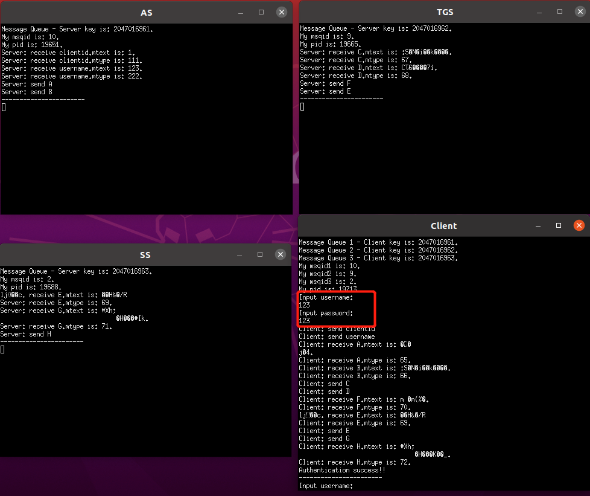
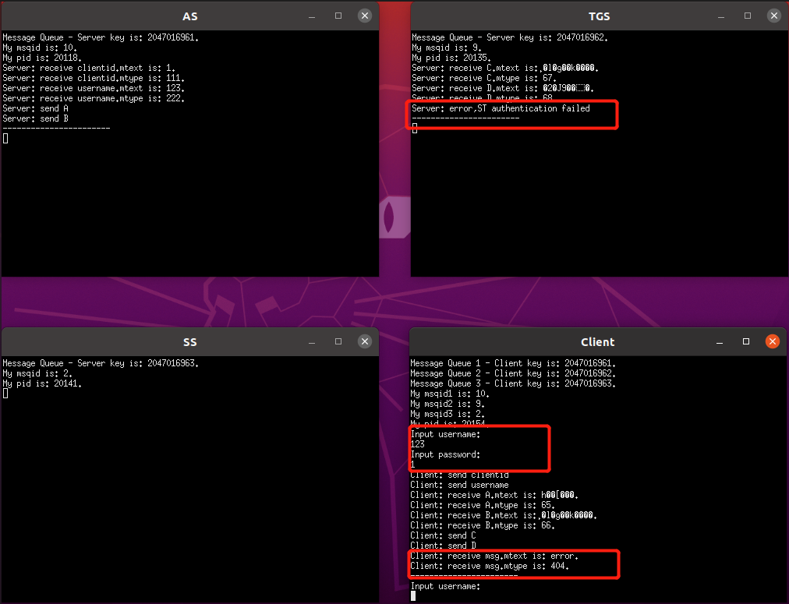
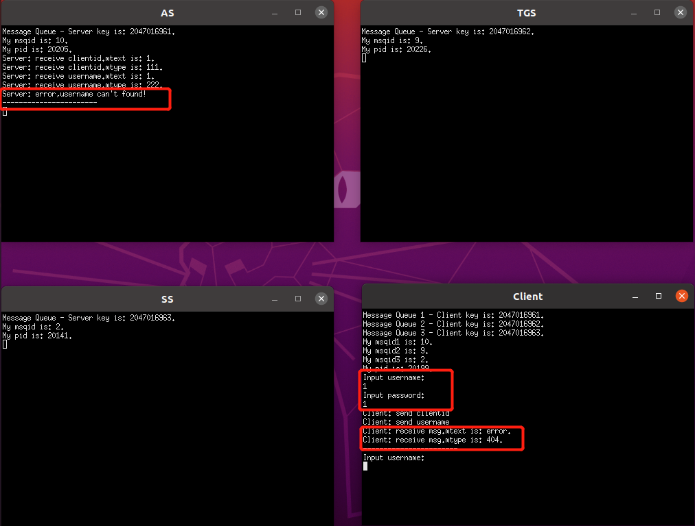
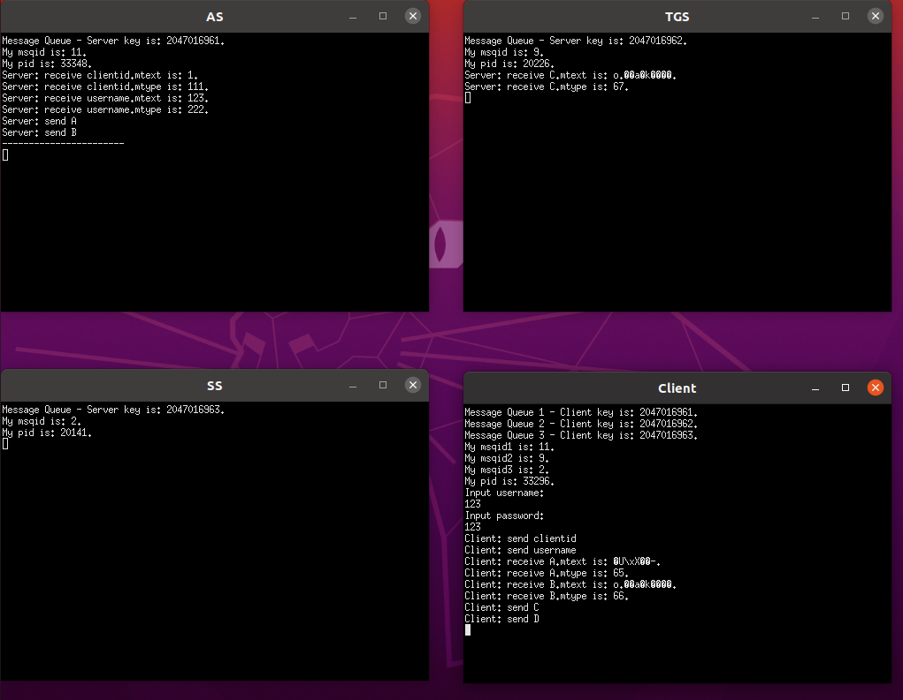
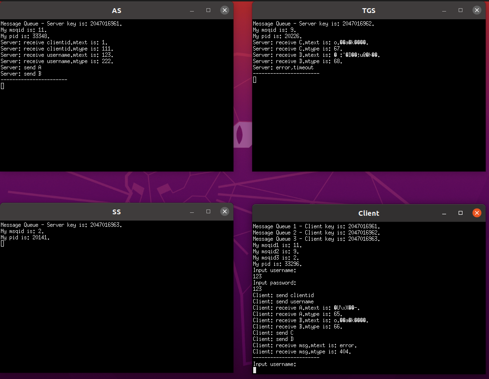
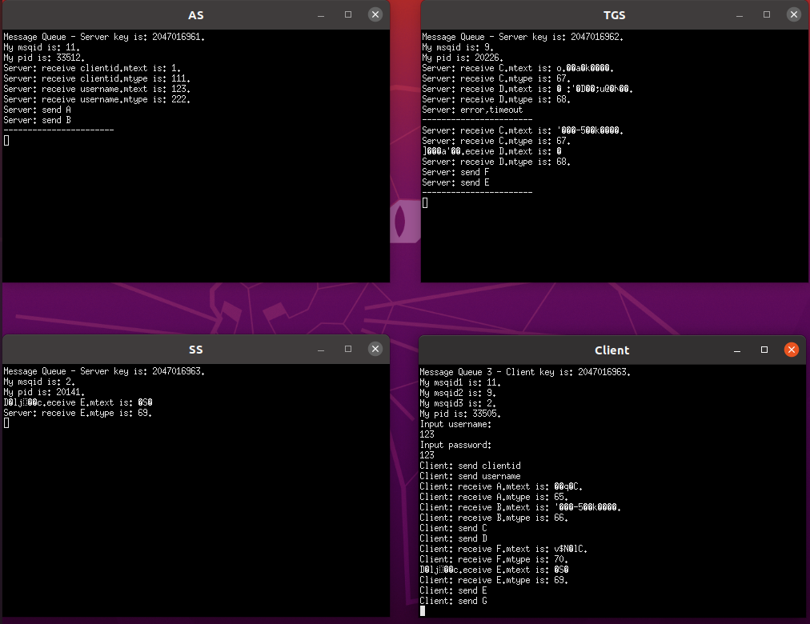
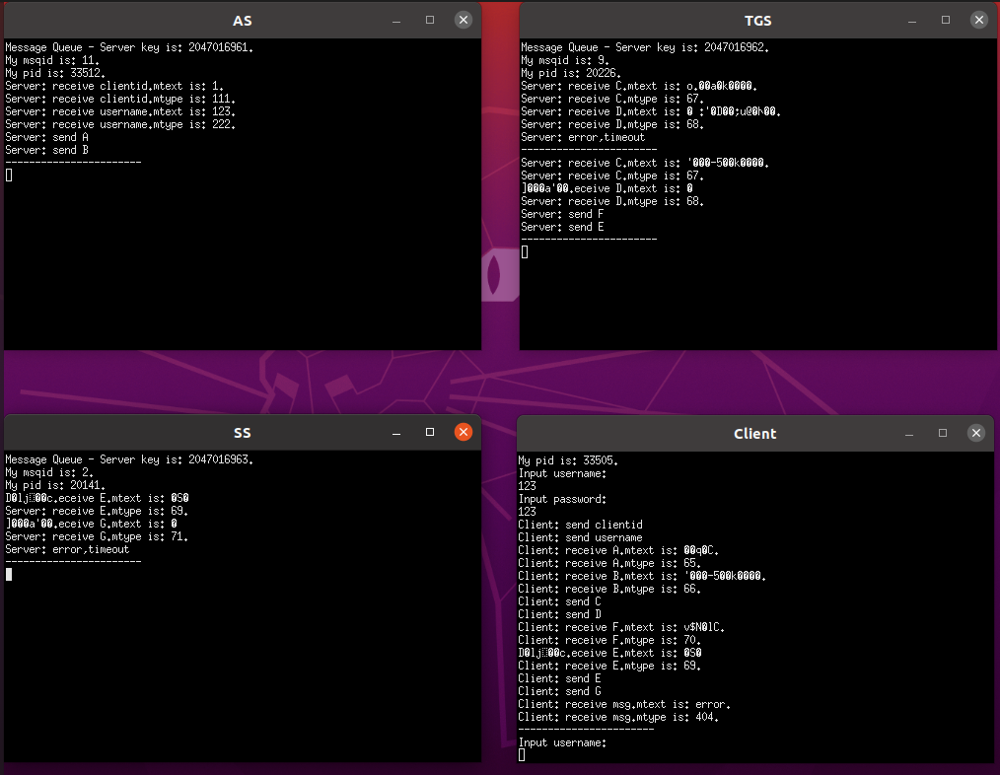

# Kerberos 认证模型程序设计报告
## 原理概述
### 简介
Kerberos简单来说就是一个用于安全认证第三方协议，它采用了传统的共享密钥的方式，实现了在网络环境不一定保证安全的环境下，client和server之间的通信，适用于client/server模型，由MIT开发和实现。

Kerberos的神秘之处在于，它并不要求通信双方所在的网络环境是安全的，即使通信过程中数据被截取或者篡改依然不会影响它的正常工作，它提供的认证是双向的，不仅能保证Server不被错误的Client使用，同时也能保证Client不使用错误的Server。同时Kerberos又严重依赖于时间，时间戳也是Kerberos用来保证通信安全的重要手段，这个一般通过通信双方同时访问同一个时间服务器来实现。Kerberos也能达到单点登录的效果，即当Client通过了Kerberos server的认证后，便可以访问多个Real Server。
### 重要概念
#### 参与者
Client、Server和KDC。                             
KDC：可信的第三方，密钥分发中心，是一个提供票据（tickets）和临时会话密钥（session keys）的网络服务。维护着一个存储着该Domain中所有帐户的Account Database，也就是说，他知道属于每个Account的名称和派生于该Account Password的Master Key。包括初始票据（initial ticket）服务和票据授予票据（ticket-granting ticket）服务，前半部分有时被称为AS，后半部分有时则被称为TGS。

#### 密钥
- Long-term Key：用户输入的用户名和口令密码构成长期密钥 (Long-term Key)。长期密钥在本地保管，其加密的数据不应该在网络上传输以规避暴力攻击。
- Master Key：口令密码通过 Hash 函数或其它内嵌规则
转换成用于对称密码体系的 Client/User 主密钥 KClient，这是客户机用户和AS预先协商好的主密钥`KClient` (Master Key)
- Short-term Key / Session Key：短期密钥或会话密钥，由于被Long-term Key加密的数据包不能用于网络传送，所以我们使用另一种Short-term Key来加密需要进行网络传输的数据。它们通过上述主密钥实现交换或发布。

#### 主体
- AS = Authentication Server
- TGT = Ticket-Granting Ticket
- TGS = Ticket-Granting Server
- ST = Service Ticket
- SS = Service Server

### 认证流程
包括三个子协议：
(a) Authentication Service Exchange to obtain ticket-granting ticket
- Client向AS发出明文服务请求。
- KDC中的AS实现对Client身份的确认，并颁发给该Client一个票据授权票据`TGT`，同时返回用主密钥`KClient`加密的会话密钥`KClient-TGS`。

(b) Ticket-Granting Service Exchange to obtain service-granting ticket
- Client使用上一步得到的会话密钥`KClient-TGS`和`TGT`向TGS发出服务认证请求。
- KDC中的TGS实现对Client服务的认证，并颁发给该Client一个服务票据`ST`，同时返回用会话密钥`KClient-TGS`加密的会话密钥`KClient-SS`。

(c) Client/Server Authentication Exchange to obtain service
- Client使用上一步得到的会话密钥`KClient-SS`和`ST`向SS发出服务申请
- SS验证ST，成功后向Client提供其所请求的服务。

### 我的理解
本质上还是验证用户输入的用户名和密码与AD（账号数据库）中存储的信息是否一致。

#### KDC
之所以引入KDC，主要是因为长期密钥（密码）有这样的使用原则：被Long-term Key加密的数据不应该在网络上传输，所以需要KDC来分发会话密钥和票据，用于客户端和服务器之间进行对称加密传输以及认证。

#### Authenticator
为了进行有效的认证，Client需要提供更多的证明信息，我们把这种证明信息称为Authenticator，在Kerberos的Authenticator实际上就是关于Client的一些信息和当前时间的一个Timestamp。

引入KDC后用户密码正确性的验证转移到由Server通过比较Authenticator中的Client Info和Session Ticket中的Client Info从而实现对Client的认证。

注意到如果用户输入的密码是错误密码，那么用户不会获得正确的`Kclient`，也就无法解密AS返回的消息A从而获得会话密钥`Kclient_tgs`，从而无法发送一个能用Kclient_tgs解密出Client Info的消息D（Authenticator），那么TGS在比较Authenticator中的Client Info和Ticket-Granting Ticket中的Client Info时就会发现不一致，从而得出认证失败的结果。

这里的Client Info可以由Client明文发送给AS，Client Info的内容是否真实并不重要，只要保证AS和Client所验证的Client Info一致即可，即使有冒充者向AS发送了伪造的Client Info A，而自己在Authenticator中使用另一个Client Info B也无济于事，因为冒充者不可能推理出一个加密方式来得到一个密文，这个密文用Kclient_tgs解密出Client InfoA（基于DES加密的安全性）。

#### Timestamp
为防止重放攻击，客户端发送的Authenticator中有个时间戳，在服务器对Authenticator中的Client Info和Session Ticket中的Client Info进行比较之前，会先提取Authenticator中的Timestamp，并同当前的时间进行比较，如果他们之间的偏差超出一个可以接受的时间范围（一般是5mins），Server会直接拒绝该Client的请求。只有当Authenticator中的Timestamp晚于通过一个Client的最近的认证时间的情况下，Server采用进行后续的认证流程。

#### 双向认证
不但Server可以对Client 进行认证，Client也能对Server进行认证。Server在对Client认证成功之后，会把Authenticator中的Timestamp提出出来加上1，通过Session Key进行加密，当Client接收到并使用Session Key进行解密之后，如果确认Timestamp是原来的Timestamp+1，那么他可以认定Server正式他试图访问的Server。

可以发现Kerberos严重依赖于时间，时间戳也是Kerberos用来保证通信安全的重要手段。

#### 票据
Client用长期密钥（密码）向AS发起身份认证，从AS获得一个票据授予票据TGT。

之后，Client可以凭借这个TGT向TGS请求ST，ST可以用来向SS证明身份。

只要TGT是有效的（在有效期内），请求者就可以从不同的提供者获得不同的服务票据ST，而无须再次标识自己。通过这种方式可以实现单点登录。

## 总体结构设计
分为四个项目
- AS
  - `md5.h` 定义了MD5上下文类和MD5操作函数
  - `md5.c` 实现了MD5操作函数
  - `des.h` 定义了DES对称加解密的两个主要函数
  - `des.c` 加解密函数的实现
  - `main.c` 实现认证服务器AS的具体功能
- TGS
  - `des.h` 定义了DES对称加解密的两个主要函数
  - `des.c` 加解密函数的实现
  - `main.c` 实现票据授予服务器TGS的具体功能
- SS

  - `des.h` 定义了DES对称加解密的两个主要函数
  - `des.c` 加解密函数的实现
  - `main.c` 实现服务服务器SS的具体功能 
- CLIENT

  - `des.h` 定义了DES对称加解密的两个主要函数
  - `des.c` 加解密函数的实现
  - `main.c` 实现用户 (User) 基于客户机程序 (Client) 登录并向SS请求服务的功能


## 模块分解
### AS
#### 初始化AD(Account Database)
在AD中初始化了一个账户，用户名为**123**，密码为**123**，主密钥通过md5算法散列生成，取散列结果的前8个字节。

```c
//Account Database
struct userinfo userinfos[100];
int userinfolength=1;
strcpy(userinfos[0].username, "123");
strcpy(userinfos[0].password, "123");
unsigned char md5hash[16];
md5_digest(userinfos[0].password,strlen((char*)userinfos[0].password),md5hash);
memcpy(userinfos[0].masterkey,md5hash,8);
```

#### 消息队列初始化
总的来说包括如下几个步骤：获得key值，创建消息队列得到队列标识符。

```c
int msqid;
key_t key;
struct msg_form msg;
// 获取key值
if((key = ftok(MSG_FILE,'z')) < 0)
{
	perror("ftok error");
	exit(1);
}

// 打印key值
printf("Message Queue - Server key is: %d.\n", key);
// 创建消息队列
msqid = msgget(key, IPC_CREAT|0777);
//msgctl(msqid, IPC_RMID, 0);
//msqid = msgget(key, IPC_CREAT|0777);

// 打印消息队列ID及进程ID
printf("My msqid is: %d.\n", msqid);
printf("My pid is: %d.\n", getpid());
```
#### 接收明文客户端id并解析
通过消息队列接收来自客户端的类型为111的消息，消息内容为明文客户端id，存入字符数组`client_id`中。

```c
//接收明文客户端id
msgrcv(msqid, &msg, 256, 111, 0);// 返回类型为111的第一个消息
printf("Server: receive clientid.mtext is: %s.\n", msg.mtext);
printf("Server: receive clientid.mtype is: %ld.\n", msg.mtype);

char client_id[50];
sprintf(client_id, msg.mtext);
//printf("strlen(client_id):%d\n",strlen(client_id));
```

#### 接收明文用户名并解析
通过消息队列接收来自客户端的类型为222的消息，消息内容为明文用户名，在AD中查找有无对应条目，如果有，初始化KClient，如果没有，向客户端发送一个错误信息并终止此次认证。

```c
//接收明文用户名
msgrcv(msqid, &msg, 256, 222, 0);// 返回类型为222的第一个消息
printf("Server: receive username.mtext is: %s.\n", msg.mtext);
printf("Server: receive username.mtype is: %ld.\n", msg.mtype);

int find=0;
unsigned char kclient[8];
for(int i=0;i<userinfolength;i++){
	//printf("-------%d\n",strcmp((char*)userinfos[i].username,(char*)msg.mtext));
	if(strcmp((char*)userinfos[i].username,(char*)msg.mtext)==0){
		memcpy(kclient,userinfos[i].masterkey,8);
		find=1;
		break;
	}
}
//如果数据库不存在该用户 ID 的记录
if(find==0){
	printf("Server: error,username can't found!\n");
	msg.mtype = 404; // 客户端接收的消息类型
	sprintf(msg.mtext, "error");
	msgsnd(msqid, &msg, sizeof(msg.mtext), 0);
	printf("-----------------------\n");
	continue;
}
msg.mtype = 404; // 客户端接收的消息类型
sprintf(msg.mtext, "no error");
msgsnd(msqid, &msg, sizeof(msg.mtext), 0);
```

#### 随机生成会话密钥KClient-TGS
为保证安全性，会话密钥采用随机生成方法获得。

```c
//随机生成会话密钥
unsigned char kclient_tgs[8];
srand((int)time(0));
for(int i=0;i<8;i++){
	kclient_tgs[i]=rand()%128;
	//printf("%c",kclient_tgs[i]);
}
//printf("\n");
```

#### AS返回消息A给Client
消息A内容为：

E(KClient , KClient-TGS)

以KClient作为密钥采用DES对称加密算法加密会话密钥KClient-TGS生成的密文。

```c
//返回消息A
printf("Server: send A\n");
msg.mtype = 'A'; // 客户端接收的消息类型
unsigned char messagea[8];
Encrypt(kclient_tgs, 8,kclient, messagea);
memcpy(msg.mtext, messagea,8);
msgsnd(msqid, &msg, sizeof(msg.mtext), 0);
```

#### AS返回消息B给Client
消息B内容为：
TGT = E(KTGS , <KClient-TGS,client ID>)

以KTGS作为密钥采用DES对称加密算法加密会话密钥KClient-TGS与客户端ID的连接字符串生成的密文。

```c
//返回消息B
printf("Server: send B\n");
msg.mtype = 'B'; // 客户端接收的消息类型
unsigned char messageb[100];
unsigned char plain[100];
memcpy(plain,kclient_tgs,8);
memcpy(plain+8,client_id,strlen(client_id));
int plainsize=8+strlen(client_id);
int ciphersize=Encrypt(plain, plainsize,ktgs, messageb);
memcpy(msg.mtext, messageb,ciphersize);
msg.mtext[ciphersize]='\0';
msgsnd(msqid, &msg, sizeof(msg.mtext), 0);
```

### TGS
#### 消息队列初始化
总的来说包括如下几个步骤：获得key值，创建消息队列得到队列标识符。
代码与AS的相同。

#### 接收消息C并解析
通过消息队列接收来自客户端的类型为'C'（字符C的ASCII码）的消息，该消息为**TGT**，消息内容为与消息B相同：

E(KTGS , <KClient-TGS,client ID>)

应用 D(KTGS , B) 得到 KClient-TGS 和 client ID，分别存入无符号字符数组`kclient_tgs`,`client_id_a`中。


```c
//接收消息C
msgrcv(msqid, &msg, 256, 'C', 0);// 返回类型为111的第一个消息
printf("Server: receive C.mtext is: %s.\n", msg.mtext);
printf("Server: receive C.mtype is: %ld.\n", msg.mtype);

unsigned char tgt[100];
sprintf(tgt, msg.mtext);
unsigned char plainc[100];
int plaincsize=Decrypt(tgt,strlen(tgt),ktgs,plainc);
plainc[plaincsize]='\0';
unsigned char kclient_tgs[8];
memcpy(kclient_tgs,plainc,8);
unsigned char client_id_a[50];
sprintf(client_id_a,"%s",plainc+8);
```

#### 接收消息D并解析
通过消息队列接收来自客户端的类型为'D'（字符C的ASCII码）的消息，消息内容为：

E(KClient-TGS , <timestamp, client ID>)

应用 D(KClient-TGS , D)  得到 timestamp 和 client ID，分别存入无符号字符数组`timestamp`,`client_id_b`中。

```c
//接收消息D
msgrcv(msqid, &msg, 256, 'D', 0);// 返回类型为222的第一个消息
printf("Server: receive D.mtext is: %s.\n", msg.mtext);
printf("Server: receive D.mtype is: %ld.\n", msg.mtype);
unsigned char plaind[100];
int plaindsize=Decrypt(msg.mtext,strlen(msg.mtext),kclient_tgs,plaind);
plaind[plaindsize]='\0';
unsigned char timestamp[11];
memcpy(timestamp,plaind,10);
timestamp[10]='\0';
long numtimestamp=0;
sscanf(timestamp,"%ld",&numtimestamp);

unsigned char client_id_b[50];
sprintf(client_id_b,"%s",plaind+10);
```

#### 认证与错误控制
通过验证C,D中client ID是否一致完成认证过程，同时检查认证消息D中的时间戳，和当前时间比较，如超过5min则认证失败。
认证失败发送错误信息，终止认证过程。
```c
//检查消息C,D中的client信息是否一致
if(strcmp(client_id_a,client_id_b)!=0){
	printf("Server: error,ST authentication failed\n");
	msg.mtype = 404; // 客户端接收的消息类型
	sprintf(msg.mtext, "error");
	msgsnd(msqid, &msg, sizeof(msg.mtext), 0);
	printf("-----------------------\n");
	continue;
}
//与当前时间比较，如果偏差超出一个可以接受的时间范围（5mins），Server会直接拒绝该Client的请求
long nowtimestamp=time(NULL);
if(nowtimestamp-numtimestamp>300){
	printf("Server: error,timeout\n");
	msg.mtype = 404; // 客户端接收的消息类型
	sprintf(msg.mtext, "error");
	msgsnd(msqid, &msg, sizeof(msg.mtext), 0);
	printf("-----------------------\n");
	continue;
}
msg.mtype = 404; // 客户端接收的消息类型
sprintf(msg.mtext, "no error");
msgsnd(msqid, &msg, sizeof(msg.mtext), 0);
```

#### 随机生成会话密钥KClient-SS
为保证安全性，会话密钥采用随机生成方法获得。

```c
//随机生成会话密钥
unsigned char kclient_ss[8];
srand((int)time(0));
for(int i=0;i<8;i++){
	kclient_ss[i]=rand()%128;
}
```

#### 返回消息F给Client
消息F内容为：

E(KClient-TGS , KClient-SS)

以KClient-TGS作为密钥采用DES对称加密算法加密会话密钥KClient-SS生成的密文。

```c
//返回消息F
printf("Server: send F\n");
msg.mtype = 'F'; // 客户端接收的消息类型
unsigned char messagef[8];
Encrypt(kclient_ss, 8,kclient_tgs, messagef);
memcpy(msg.mtext, messagef,8);
msgsnd(msqid, &msg, sizeof(msg.mtext), 0);
```


#### 返回消息E给Client
消息E内容为：

ST = E(KSS , <KClient-SS, client ID>) 

以KSS作为密钥采用DES对称加密算法加密会话密钥KClient-SS与客户端ID的连接字符串生成的密文。

```c
//返回消息E
printf("Server: send E\n");
msg.mtype = 'E'; // 客户端接收的消息类型
unsigned char messagee[100];
unsigned char plain[100];
memcpy(plain,kclient_ss,8);
memcpy(plain+8,client_id_a,strlen(client_id_a));
int plainsize=8+strlen(client_id_a);
int ciphersize=Encrypt(plain, plainsize,kss, messagee);
memcpy(msg.mtext, messagee,ciphersize);
msg.mtext[ciphersize]='\0';
msgsnd(msqid, &msg, sizeof(msg.mtext), 0);
```

### SS

#### 消息队列初始化
总的来说包括如下几个步骤：获得key值，创建消息队列得到队列标识符。
代码与AS的相同。


#### 接收消息E并解析
通过消息队列接收来自客户端的类型为'E'（字符E的ASCII码）的消息，该消息为**ST**

ST = E(KSS , <KClient-SS, client ID>) 

应用 D(KSS , ST) 得到 KClient-SS 和 client ID，分别存入无符号字符数组`kclient_ss`,`client_id_a`中。


```c
//接收消息E
msgrcv(msqid, &msg, 256, 'E', 0);// 返回类型为111的第一个消息
printf("Server: receive E.mtext is: %s.\n", msg.mtext);
printf("Server: receive E.mtype is: %ld.\n", msg.mtype);

unsigned char st[100];
sprintf(st, msg.mtext);
unsigned char plaine[100];
int plainesize=Decrypt(st,strlen(st),kss,plaine);
plaine[plainesize]='\0';
unsigned char kclient_ss[8];
memcpy(kclient_ss,plaine,8);
unsigned char client_id_a[50];
sprintf(client_id_a,"%s",plaine+8);
```

#### 接收消息G并解析
通过消息队列接收来自客户端的类型为'G'（字符G的ASCII码）的消息，消息内容为：

E(KClient-SS , <timestamp, client ID>)

应用 D(KClient-SS , D)  得到 timestamp 和 client ID，分别存入无符号字符数组`timestamp`,`client_id_b`中。

```c
//接收消息G
msgrcv(msqid, &msg, 256, 'G', 0);// 返回类型为222的第一个消息
printf("Server: receive G.mtext is: %s.\n", msg.mtext);
printf("Server: receive G.mtype is: %ld.\n", msg.mtype);
unsigned char plaing[100];
int plaingsize=Decrypt(msg.mtext,strlen(msg.mtext),kclient_ss,plaing);
plaing[plaingsize]='\0';
unsigned char timestamp[11];
memcpy(timestamp,plaing,10);
timestamp[10]='\0';
long numtimestamp=0;
sscanf(timestamp,"%ld",&numtimestamp);
```

#### 认证与错误控制
通过验证E,G中client ID是否一致完成认证过程，同时检查认证消息G中的时间戳，和当前时间比较，如超过5min则认证失败。
认证失败发送错误信息，终止认证过程。
```c
//与当前时间比较，如果偏差超出一个可以接受的时间范围（5mins），Server会直接拒绝该Client的请求
long nowtimestamp=time(NULL);
if(nowtimestamp-numtimestamp>300){
	printf("Server: error,timeout\n");
	msg.mtype = 404; // 客户端接收的消息类型
	sprintf(msg.mtext, "error");
	msgsnd(msqid, &msg, sizeof(msg.mtext), 0);
	printf("-----------------------\n");
	continue;
}

//检查消息C,D中的client信息是否一致
if(strcmp(client_id_a,client_id_b)!=0){
	printf("Server: error,authentication failed\n");
	msg.mtype = 404; // 客户端接收的消息类型
	sprintf(msg.mtext, "error");
	msgsnd(msqid, &msg, sizeof(msg.mtext), 0);
	printf("-----------------------\n");
	continue;
}
msg.mtype = 404; // 客户端接收的消息类型
sprintf(msg.mtext, "no error");
msgsnd(msqid, &msg, sizeof(msg.mtext), 0);
```


#### 返回消息H给Client
消息H内容为：

E(KClient-SS , <TS+1, client ID>)

以KClient-SS作为密钥采用DES对称加密算法加密时间戳+1与客户端ID的连接字符串生成的密文。

```c
//timestamp+1
numtimestamp++;
//返回消息H
printf("Server: send H\n");
msg.mtype = 'H'; // 客户端接收的消息类型
unsigned char messageh[100];
unsigned char plainh[100];
sprintf(plainh,"%ld%s",numtimestamp,client_id_a);
int hciphersize=Encrypt(plainh, strlen(plainh),kclient_ss, messageh);
memcpy(msg.mtext, messageh,hciphersize);
msg.mtext[hciphersize]='\0';
msgsnd(msqid, &msg, sizeof(msg.mtext), 0);

```

### CLIENT

#### 消息队列初始化
总的来说包括如下几个步骤：获得key值，创建消息队列得到队列标识符。
这里初始化了三个消息队列，分别与AS,TGS,SS进行通信。
```c
// key for message queue with AS
#define MSG_FILE1 "/etc"
// key for message queue with TGS
#define MSG_FILE2 "/usr"
// key for message queue with SS
#define MSG_FILE3 "/bin"

int msqid1,msqid2,msqid3;
    key_t key1,key2,key3;
   // 获取key值
    if ((key1 = ftok(MSG_FILE1, 'z')) < 0)
    {
    perror("ftok error");
    exit(1);
    }

    if ((key2 = ftok(MSG_FILE2, 'z')) < 0)
    {
    perror("ftok error");
    exit(1);
    }

    if ((key3 = ftok(MSG_FILE3, 'z')) < 0)
    {
    perror("ftok error");
    exit(1);
    }

    // 打印key值
    printf("Message Queue 1 - Client key is: %d.\n", key1);
    printf("Message Queue 2 - Client key is: %d.\n", key2);
    printf("Message Queue 3 - Client key is: %d.\n", key3);

    // 打开消息队列
    if ((msqid1 = msgget(key1, IPC_CREAT|0777)) == -1)
    {
        perror("msgget error");
        exit(1);
    }

    if ((msqid2 = msgget(key2, IPC_CREAT|0777)) == -1)
    {
        perror("msgget error");
        exit(1);
    }

    if ((msqid3 = msgget(key3, IPC_CREAT|0777)) == -1)
    {
        perror("msgget error");
        exit(1);
    }

    // 打印消息队列ID及进程ID
    printf("My msqid1 is: %d.\n", msqid1);
    printf("My msqid2 is: %d.\n", msqid2);
    printf("My msqid3 is: %d.\n", msqid3);
    printf("My pid is: %d.\n", getpid());

```

#### 用户登录
用户输入用户名和密码基于客户机程序 (Client) 进行登录。
```c
char username[50];
char password[50];
char masterkey[8];
printf("Input username:\n");
scanf("%s",username);
printf("Input password:\n");
scanf("%s",password);
```

#### 获得主密钥masterkey(KClient)
主密钥通过md5算法散列生成，取散列结果的前8个字节。
```c
unsigned char md5hash[16];
md5_digest(password, strlen(password),md5hash);
unsigned char kclient[8];
memcpy(kclient,md5hash,8);
memcpy(masterkey,md5hash,8);
```

#### Client向AS发送一个明文消息(用户名+客户端id)，代表用户请求服务
```c
//Client向AS发送一个明文消息(用户名+客户端id)，代表用户请求服务。

//发送客户端id
//添加消息，类型为111
printf("Client: send clientid\n");
msg.mtype = 111;
sprintf(msg.mtext,client_id);
msgsnd(msqid1, &msg, sizeof(msg.mtext), 0);

//发送用户名
//添加消息，类型为222
printf("Client: send username\n");
msg.mtype = 222;
sprintf(msg.mtext, username);
msgsnd(msqid1, &msg, sizeof(msg.mtext), 0);
```

#### 接收来自AS的消息
包括错误消息，消息A，消息B。

若接收到错误，终止此次认证返回到用户名输入阶段。

消息A：E(KClient , KClient-TGS)

使用密钥`kclient`解密消息A，获得密钥`kclient_tgs`。

消息B：TGT = E(KTGS , <KClient-TGS,client ID>)

Client无法解密消息B。
```c
//AS错误控制
msgrcv(msqid1, &msg, 256, 404, 0);
if(strcmp(msg.mtext,"error")==0){
	printf("Client: receive msg.mtext is: %s.\n", msg.mtext);
	printf("Client: receive msg.mtype is: %ld.\n", msg.mtype);
	printf("-----------------------\n");
	continue;
}

//接收消息A
msgrcv(msqid1, &msg, 256, 'A', 0);
printf("Client: receive A.mtext is: %s.\n", msg.mtext);
printf("Client: receive A.mtype is: %ld.\n", msg.mtype);

char kclient_tgs[8];
Decrypt(msg.mtext,8,kclient,kclient_tgs);

//接收消息B
msgrcv(msqid1, &msg, 256, 'B', 0);
printf("Client: receive B.mtext is: %s.\n", msg.mtext);
printf("Client: receive B.mtype is: %ld.\n", msg.mtype);

char tgt[100];
sprintf(tgt, msg.mtext);
```

#### Client 向 TGS 发送两条消息(C,D)
通过消息队列向TGS发送类型为'C'的消息C，内容如下：

消息C：E(KTGS , <KClient-TGS,client ID>)

通过消息队列向TGS发送类型为'D'的消息D，内容如下：

消息D：E(KClient-TGS , <timestamp, client ID>)

其中，时间戳通过c语言库<time.h>中的time()函数来获取，函数返回当前时间（sec），从1970年1月1日至此时经历的秒数。

```c
 //发送消息C
printf("Client: send C\n");
sprintf(msg.mtext, tgt);
msg.mtype = 'C';
msgsnd(msqid2, &msg, sizeof(msg.mtext), 0);

//发送消息D
printf("Client: send D\n");
msg.mtype = 'D';
unsigned char messaged[100];
unsigned char plaind[100];
long timestamp=time(NULL);
//printf("timestamp:%d\n",timestamp);
sprintf(plaind,"%ld%s",timestamp,client_id);
//printf("strlen(plaind):%d\n",strlen(plaind));
int plainsize=strlen(plaind);
int ciphersize=Encrypt(plaind, strlen(plaind),kclient_tgs, messaged);
memcpy(msg.mtext, messaged,ciphersize);
msg.mtext[ciphersize]='\0';
msgsnd(msqid2, &msg, sizeof(msg.mtext), 0);
```

#### 接收来自TGS的消息
包括错误消息，消息F，消息E。

若接收到错误，终止此次认证返回到用户名输入阶段。

消息F：E(KClient-TGS , KClient-SS)

使用密钥`kclient_tgs`解密消息F，获得密钥`kclient_ss`。

消息E：ST = E(KSS , <KClient-SS, client ID>) 

Client无法解密服务票据ST

```c
//TGS错误控制
msgrcv(msqid2, &msg, 256, 404, 0);
if(strcmp(msg.mtext,"error")==0){
	printf("Client: receive msg.mtext is: %s.\n", msg.mtext);
	printf("Client: receive msg.mtype is: %ld.\n", msg.mtype);
	printf("-----------------------\n");
	continue;
}

//接收消息F
msgrcv(msqid2, &msg, 256, 'F', 0);
printf("Client: receive F.mtext is: %s.\n", msg.mtext);
printf("Client: receive F.mtype is: %ld.\n", msg.mtype);

char kclient_ss[8];
Decrypt(msg.mtext,8,kclient_tgs,kclient_ss);

//接收消息E
msgrcv(msqid2, &msg, 256, 'E', 0);
printf("Client: receive E.mtext is: %s.\n", msg.mtext);
printf("Client: receive E.mtype is: %ld.\n", msg.mtype);

char st[100];
sprintf(st, msg.mtext);
```

#### Client 向 SS 发送两条消息(E,G)
通过消息队列向SS发送类型为'E'的消息E，内容如下：

消息E：ST = E(KSS , <KClient-SS, client ID>) 

通过消息队列向SS发送类型为'G'的消息G，内容如下：

消息G：E(KClient-SS , <timestamp, client ID>)

其中，时间戳通过c语言库<time.h>中的time()函数来获取，函数返回当前时间（sec），从1970年1月1日至此时经历的秒数。

```c
//Client 向 SS 发送以下两条消息
//发送消息E
printf("Client: send E\n");
msg.mtype = 'E';
sprintf(msg.mtext,st);
msgsnd(msqid3, &msg, sizeof(msg.mtext), 0);

//发送消息G
printf("Client: send G\n");
msg.mtype = 'G';
unsigned char messageg[100];
unsigned char plaing[100];
timestamp=time(NULL);
//printf("timestamp:%d\n",timestamp);
sprintf(plaing,"%ld%s",timestamp,client_id);
//printf("strlen(plaind):%d\n",strlen(plaing));
int gciphersize=Encrypt(plaing, strlen(plaing),kclient_ss, messageg);
memcpy(msg.mtext, messageg,ciphersize);
msg.mtext[gciphersize]='\0';
msgsnd(msqid3, &msg, sizeof(msg.mtext), 0);
```

#### 接收来自SS的消息
包括错误消息，消息H。

若接收到错误，终止此次认证返回到用户名输入阶段。

消息H：E(KClient-SS , <TS+1, client ID>)

使用密钥`kclient_ss`解密消息H，获得时间戳TS+1和client ID。

如果其中的时间戳被正确更新，则 SS 可以信赖，Client 可以向 SS 发送服务请求。

```c
//SS错误控制
msgrcv(msqid3, &msg, 256, 404, 0);
if(strcmp(msg.mtext,"error")==0){
	printf("Client: receive msg.mtext is: %s.\n", msg.mtext);
	printf("Client: receive msg.mtype is: %ld.\n", msg.mtype);
	printf("-----------------------\n");
	continue;
}

//接收消息H
msgrcv(msqid3, &msg, 256, 'H', 0);
printf("Client: receive H.mtext is: %s.\n", msg.mtext);
printf("Client: receive H.mtype is: %ld.\n", msg.mtype);

unsigned char plainh[100];
int plainhsize=Decrypt(msg.mtext,strlen(msg.mtext),kclient_ss,plainh);
plainh[plainhsize]='\0';
unsigned char newtimestamp[11];
memcpy(newtimestamp,plainh,10);
newtimestamp[10]='\0';
unsigned char client_id_h[50];
sprintf(client_id_h,"%s",plainh+10);
long numnewtimestamp=0;
sscanf(newtimestamp,"%ld",&numnewtimestamp);

//如果其中的时间戳被正确更新，则 SS 可以信赖，Client 可以向 SS 发送服务请求
if(numnewtimestamp==timestamp+1){
	printf("Authentication success!!\n");
}
else{
	printf("Authentication failed!!\n");
}
```


## 数据结构设计
- 变量类型
    - 8位字节 `unsigned char`

- 结构体
	使用用户信息结构体表示AD中的账户信息，包括用户名，密码和由密码散列生成的主密钥。

	```c
	struct userinfo{
		unsigned char username[50];
		unsigned char password[50];
		unsigned char masterkey[8];
	};
	```
	通过消息队列进行进程间通讯使用的结构体。
	```c
	// 消息结构
	struct msg_form {
		long mtype;
		unsigned char mtext[M_SIZE];
	};
	```


- 数组
	使用无符号字符数组保存DES加解密使用的密钥，例如：
	```c
	unsigned char ktgs[8]="thisatgs";
	```

## C语言源代码
见附件

## 验证用例及编译运行结果

### 环境
- ubuntu 20.04 64bit
- codeblocks 20.03
### 验证用例
#### Testcase #1
输入正确的用户名和密码：

123

123



双向认证成功！

#### Testcase #2
输入存在的用户名和错误的密码：

123

1


服务认证失败，无法获得ST。

#### Testcase #3
输入不存在的用户名：

1

1


用户名不存在，身份认证失败，无法获得TGT。

#### Testcase #4
在生成认证消息D后延时发送，模拟重放攻击

在client代码中设置

`sleep(350);`

进程睡眠结束前：



进程睡眠结束后：



时间戳超时，服务认证失败！

#### Testcase #5
在生成认证消息G后延时发送，模拟重放攻击

在client代码中设置

`sleep(350);`

进程睡眠结束前：



进程睡眠结束后：



时间戳超时，服务申请失败！


