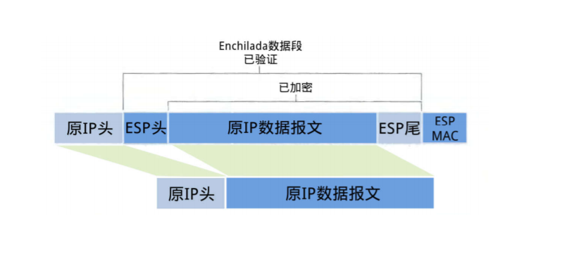
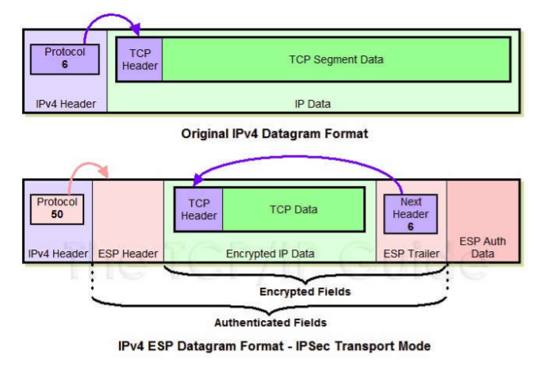
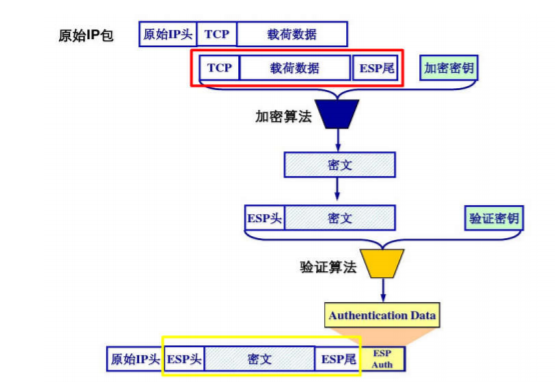

# IPSec 传输模式下 ESP 报文的装包与拆包过程

## IPSec
IPSec是互联网安全协议（Internet Protocol Security）的缩写，是一个网络传输协议族，通过对IP协议的分组进行加密和认证来保护IP协议；

IPsec主要由以下协议组成：
一、**认证头（AH）**，为IP数据报提供无连接数据完整性、消息认证以及防重放攻击保护；
二、**封装安全载荷（ESP）**，提供机密性、数据源认证、无连接完整性、防重放和有限的传输流（traffic-flow）机密性；
三、**安全关联（SA）**，提供算法和数据包，提供AH、ESP操作所需的参数。
四、**密钥协议（IKE）**，提供对称密码的钥匙的生存和交换。

IPsec 对数据进行加密的方式有两种：传输模式和隧道模式。
-  **传输模式**只对 IP 协议报文的有效数据载荷部分 (payload) 进行加密，因此需要对原始 IP 报文进行拆装。
-  **隧道模式**对整个 IP 协议报文进行加密，相当于把原始 IP 报文封装在一个安全的隧道进行传输，保持了原始 IP 报文的完整性。

## ESP 报文封装结构
传输模式下，原始IP报文被拆解，在其有效载荷前面加上新的ES协议头，再装回原来的IP地址，形成新的IPsec报文。**新IP头保存ESP协议类型50**，其报文结构如下图所示。

## 装包过程

1. 取出原IP头，修改协议号为 50，标识这是一个ESP报文，并把加密算法、验证算法 、共享会话密钥 、密钥使用期限等信息放进 SA。
2. 根据 IP 头修改的数据，在原 IP 数据报文末尾添加ESP尾（ESP Trailer）,包括**Padding、Pad Length、Next Header**。
- 由于所选加密算法可能是块加密，当最后一块长度不足时就需要填充 (padding)，附上填充长度 (Pad length) 方便解包时顺利找出用来填充的那一段数据。
- Next header 用来标明被封装的原报文的协议类型，例如 4 (= IP)。
  
3. 根据选择的加密算法，将原IP数据报文和ESP尾作为一个整体加密。
4. 在把上一步整体加密的数据前添加一个 ESP 头（ESP header），ESP header由 SPI 和 Seq# 两部分组成。加密数据与 ESP header 合称为 “Enchilada”，构成认证部分Authenticated Fields。注意到被封装的原报文的协议类型受到保护，由加密的 ESP trailer 的 Next header 声明，而不出现在未加密的 ESP header 中。
5. 根据上一步得到的Enchilada，计算一个32位整数倍的完整性度量值 (消息认证码 MAC)，并附在ESP报文的尾部，构成 ESP Auth Data。验证算法由SA给出。
6. 在报文头部添加修改后的原IP头。

## 拆包过程
1. 接收方收到 IP 报文后，发现协议类型是50，表明这是一个**ESP包**。而且还会通过SA知道其加密算法和解密密钥、度量算法和认证密钥。
2. 查看 ESP Auth Data，计算 “Enchilada” 部分的摘要，两相对比来对Enchilada进行**完整性验证**，确保收到的数据是无损失的，最后丢弃该部分。
3. 查看 ESP 头 Seq# 中的**序列号**，确定数据是最新的，这是为了**防止回放攻击**，最后丢弃该部分。
4. 根据 SA 所提供的加密算法和密钥，**解密报文**，得到原 IP 数据报文和 ESP 尾。
5. 通过分析 ESP 尾部中的填充长度信息**删除填充**得到原 IP 数据报文。
6. 最后修改收到的IP报文头的协议类型为ESP尾部中的Next Header标明的协议类型得到**原IP头**，与原IP数据报文拼接得到原 IP 报文，根据原 IP 报文目的地址进行转发。